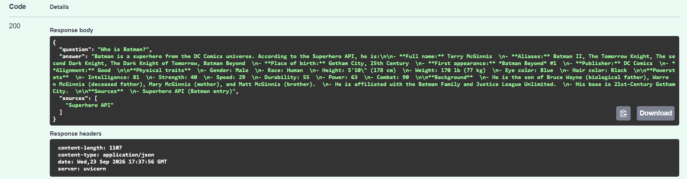
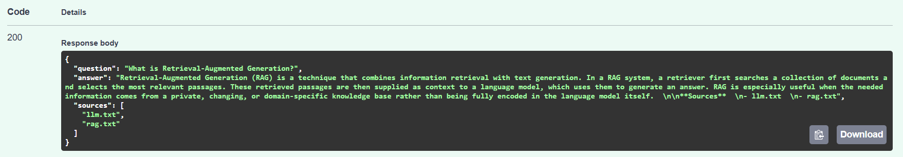
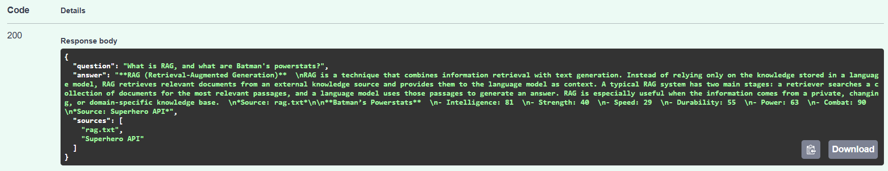

# AI Engineer Assessment Chatbot

A FastAPI chatbot that answers questions using a text knowledge base and the Superhero API. An LLM-based router determines whether a question requires the text dataset, the Superhero API, or both. A hosted Groq LLM then generates the final answer with explicit source attribution.

## Architecture


The system follows a hybrid routing approach:

1. The user's question is received through `POST /ask`.
2. A hosted LLM determines whether the question is related to the text dataset, superheroes, or both.
3. The proposed route is verified before retrieving information.
4. Relevant information is retrieved from the TF-IDF text retriever and/or the Superhero API.
5. The retrieved context is provided to the hosted Groq LLM.
6. The generated response includes the sources used.

## Setup

### 1. Create a virtual environment

```bash
python -m venv .venv
```

Activate it on Windows:

```bash
.venv\Scripts\activate
```

### 2. Install dependencies

```bash
pip install -r requirements.txt
```

### 3. Configure API keys

Create a `.env` file in the project root:

```env
GROQ_API_KEY=your_groq_api_key
SUPERHERO_API_TOKEN=your_superhero_api_token
```

The API keys are loaded from environment variables and are not included in the repository.

## Run

Start the FastAPI server:

```bash
python -m uvicorn app:app --reload
```

The API will be available at:

```text
http://127.0.0.1:8000
```

Interactive Swagger documentation:

```text
http://127.0.0.1:8000/docs
```

## API

### `POST /ask`

The endpoint accepts a natural-language question.

Example request:

```json
{
  "question": "What is RAG, and what are Batman's powerstats?"
}
```

Example response:

```json
{
  "question": "What is RAG, and what are Batman's powerstats?",
  "answer": "...",
  "sources": ["rag.txt", "Superhero API"]
}
```

The `sources` field identifies where the information used to answer the question came from.

## Example Questions

### Superhero

```text
Who is Batman?
```

This is routed to the Superhero API.

### Text Dataset

```text
What is Retrieval-Augmented Generation?
```

This is answered using the text knowledge base.

### Combined

```text
What is RAG, and what are Batman's powerstats?
```

This requires information from both the text knowledge base and the Superhero API.

## Validation and Error Handling

The API includes basic validation and error handling for:

- Empty questions
- Questions exceeding the maximum allowed length
- Superhero API failures
- Hosted LLM failures
- Unexpected application errors

## Testing

Core functionality was tested with:

- Text-based questions
- Superhero questions
- Questions requiring both sources
- Invalid input
- External service failures

## Screenshots

### Architecture


### Superhero Query



### Text Query



### Combined Query



## Technologies

- Python
- FastAPI
- Scikit-learn / TF-IDF
- Superhero API
- Groq API
- Pydantic
- Uvicorn
