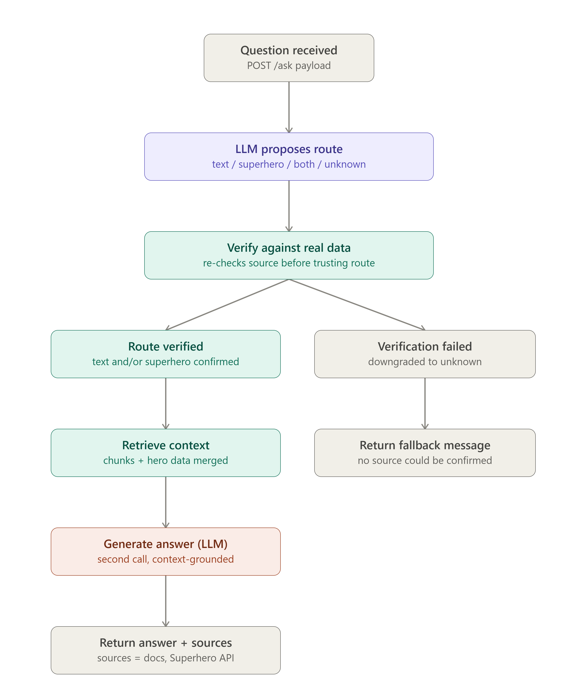

# AI Engineer Assessment Chatbot

A FastAPI chatbot that answers questions using a text knowledge base and the Superhero API. An LLM-based router determines whether a question requires the text dataset, the Superhero API, or both. A hosted Groq LLM then generates the final answer with explicit source attribution.

## Architecture

The system uses a hybrid routing approach:

1. The user's question is received through `POST /ask`.
2. A hosted LLM proposes whether the question requires the text dataset, the Superhero API, or both.
3. The proposed route is deterministically verified using the actual available sources.
4. Relevant information is retrieved using the TF-IDF retriever and/or the Superhero API.
5. The retrieved information is provided as context to the hosted Groq LLM.
6. The LLM generates the final answer and identifies the sources used.

The LLM is used for flexible natural-language routing, while deterministic verification checks that the required source actually provides relevant information.

## Project Structure

- `app.py` — Main application containing the FastAPI endpoint, LLM routing, deterministic route verification, TF-IDF retrieval, Superhero API integration, and answer generation.
- `chatbot.ipynb` — Development and testing notebook used to experiment with and test the chatbot components.
- `requirements.txt` — Python dependencies required to run the application.
- `.env.example` — Example configuration showing the required API keys without exposing real credentials.
- `.gitignore` — Prevents secrets, the virtual environment, Python cache files, and other local files from being committed.
- `README.md` — Project setup, architecture, API usage, and testing information.
- `screenshots/` — Architecture and API query screenshots.

## Setup

### 1. Create a virtual environment

Run:

`python -m venv .venv`

Activate it on Windows:

`.venv\Scripts\activate`

### 2. Install dependencies

Run:

`pip install -r requirements.txt`

### 3. Configure API keys

Create a `.env` file in the project root:

`GROQ_API_KEY=your_groq_api_key`

`SUPERHERO_API_TOKEN=your_superhero_api_token`

The API keys are loaded from environment variables and are not included in the repository.

## Run

Start the FastAPI server:

`python -m uvicorn app:app --reload`

The API will be available at:

`http://127.0.0.1:8000`

Interactive Swagger documentation:

`http://127.0.0.1:8000/docs`

## API

### `POST /ask`

The endpoint accepts a natural-language question.

Example request:

`{"question": "What is RAG, and what are Batman's powerstats?"}`

Example response:

`{"question": "What is RAG, and what are Batman's powerstats?", "answer": "...", "sources": ["rag.txt", "Superhero API"]}`

The `sources` field identifies where the information used to answer the question came from.

## Example Questions

### Superhero

`Who is Batman?`

This is routed to the Superhero API.

### Text Dataset

`What is Retrieval-Augmented Generation?`

This is answered using the text knowledge base.

### Combined

`What is RAG, and what are Batman's powerstats?`

This requires information from both the text knowledge base and the Superhero API.

## Validation and Error Handling

The API includes basic validation and error handling for:

- Empty questions
- Questions exceeding the maximum allowed length
- Superhero API failures
- Hosted LLM failures
- Unexpected application errors

## Testing

Core functionality was tested with:

- Text-based questions
- Superhero questions
- Questions requiring both sources
- Invalid input
- External service failures

## Screenshots

### Superhero Query

### Text Query

### Combined Query

## Technologies

- Python
- FastAPI
- Scikit-learn / TF-IDF
- Superhero API
- Groq API
- Pydantic
- Uvicorn
